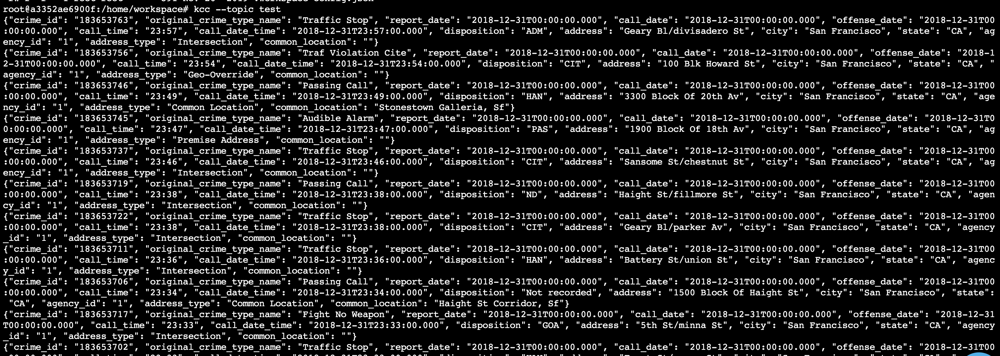
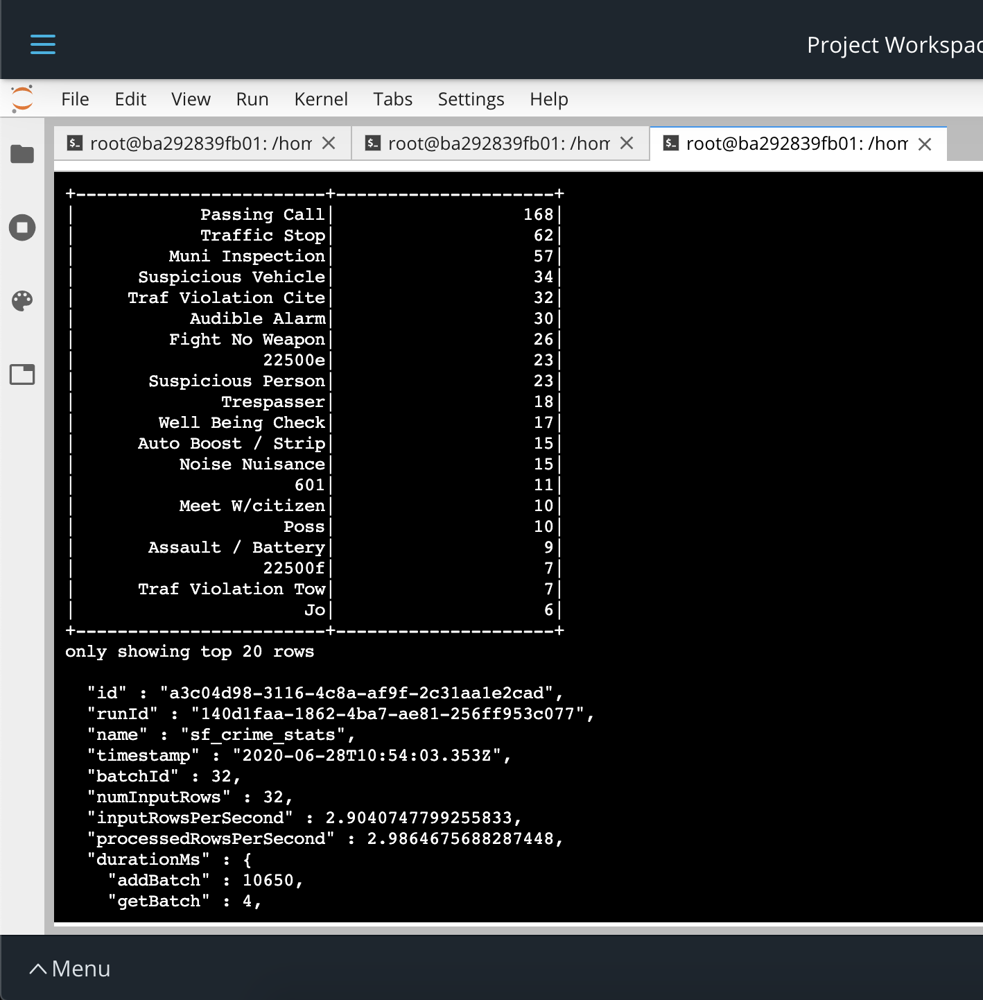
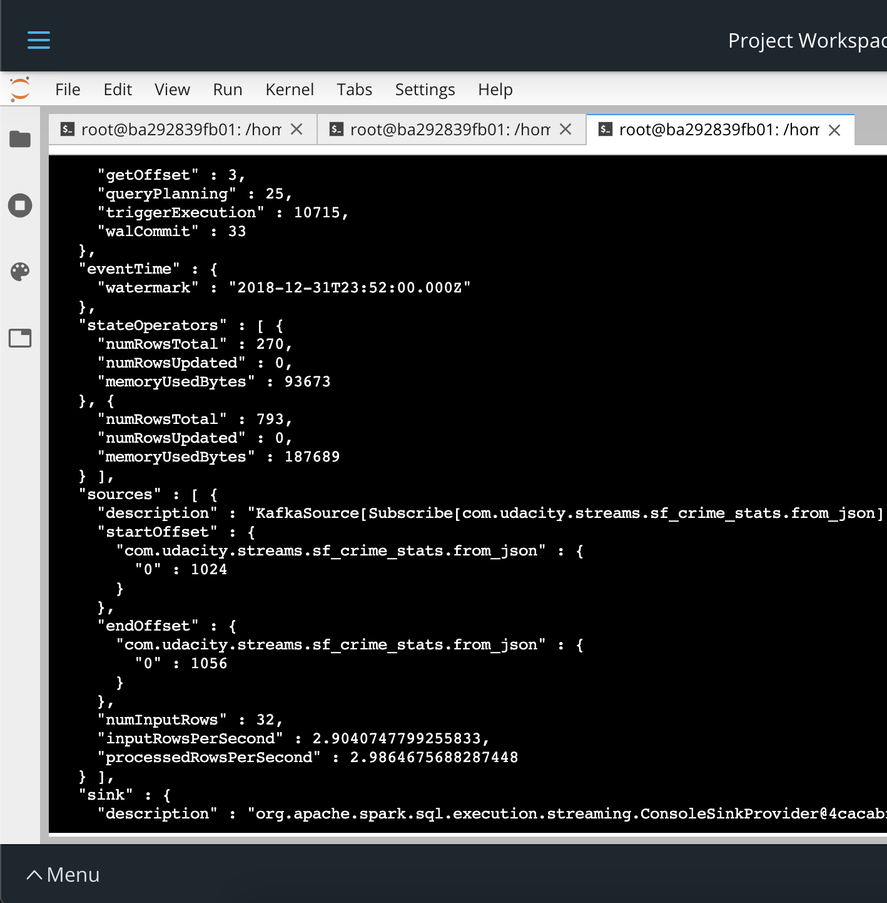
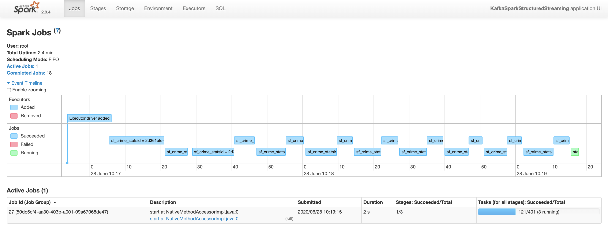
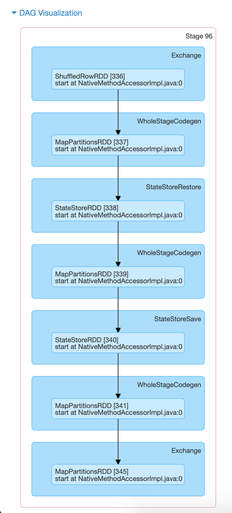

# San Fransisco Crime Statistics

## How to run it

### Setting up the environment
`./start.sh` 

### Start producing
`python kafka_server.py`

### Consume messges
`spark-submit --packages org.apache.spark:spark-sql-kafka-0-10_2.11:2.3.4 --master local[*] data_stream.py`

## Evidences

### Kafka Console Consumer 

### Spark ProgressReporter 

### Spark UI

## Parameter evaluation

1. How did changing values on the SparkSession property parameters affect the throughput and latency of the data?
 
Increasing the batch size in the spark job (maxOffsetsPerTrigger/maxRatePerPartition) helped with ingesting enough data into the pipeline to leverage the processing power and reducing. 
Then adjusting the driver memory (spark.driver.memory) helped to speed up the orchestration of the various input and output activities. 
As for the compute capabilties (spark.executor.memory) it showed that a small increase yielded a small improvement. Yet further increasing it yielded no measurable benefits. This is presumably due to the comparbly modearate complexity of the pipeline operations, so that adittional ressources cannot be used to increase the overall performance.

2. What were the 2-3 most efficient SparkSession property key/value pairs? Through testing multiple variations on values, how can you tell these were the most optimal?

maxRatePerPartition[1] | executor.memory | driver.memory | timeSec | numBatches | numMessages | messagesPerSec 
---| ---| ---| ---| ---| ---| ---| 
  32 | 512m | 1g | 533 | 50 | 1600 | 3.0 
 128 | 512m | 1g | 312 | 20 | 2560 | 8.2
 128 | 512m | 4g | 548 | 40 | 5120 | 9.3 
 128 | 2g   | 4g | 658 | 50 | 6400 | 9.7 
 128 | 2g   | 2g | 487 | 35 | 4480 | 9.2 
 128 | 1g   | 4g | 520 | 40 | 4992 | 9.6

The results in the table above showcase that further increasing memory for executor or driver did not have a significant effect on the overall result. They indicate a local optimum, where varying the input parameters don't have an impact on the overall objective. For an global optimum, it would need an isolated, dedicated system with and more granular modification of the input parameters, along with including others (e.g. increasing partitions of topics and the degrees of freedom to parallelize the execution.

